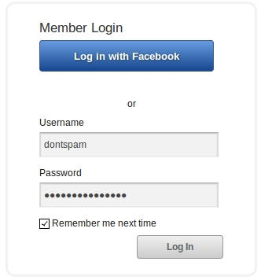

## Table of Contents
* Toc
{:toc}

## Alternative

__Goal__: Let the user choose between two different forms.

__Bad solution__ (visually pleasing): Display them side-by-side. 

__Why is it bad?__: It's hard to see whether you have to fill the whole second form or just the second half of it. 

__Good solution__: Display forms one after the other.

